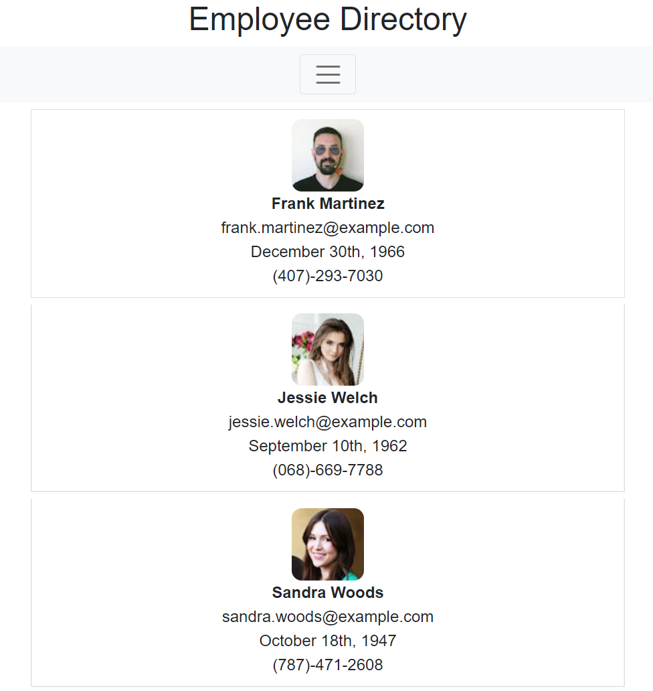

# Employee Directory

## Take A Glance!



[https://hstor3.github.io/employee-directory/](https://hstor3.github.io/employee-directory/)

## About

Looking for a new way to look up employees? Look no further! With this app, you are able to search an employee by name or sort them alphabetically. Need to email or call an employee? Just click on their phone number or email to get in touch with them.

### Built With


## Installation

1. Clone the reop

```sh
git clone https://github.com/hstor3/employee-directory.git
```

2. Install the packages

```sh
npm install
```

## Get Started!

After cloning the repo and installing the packages, you can run an 'npm start' to view the website via local host in the browser.

## Contributing

Any contributions are greatly appreciated!

## License

